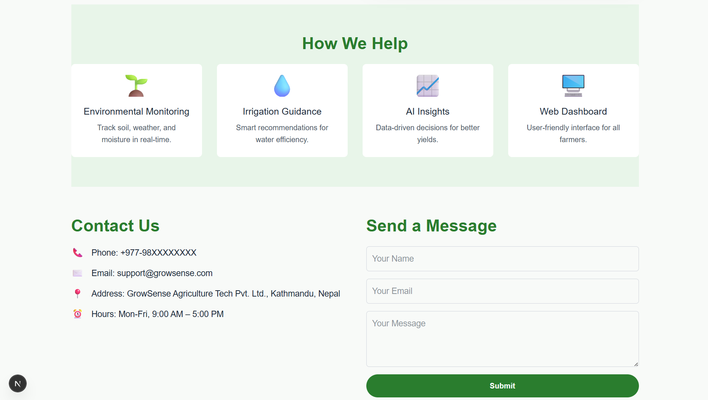

# GrowSense 🌿

An intelligent agriculture platform that helps farmers automate irrigation and make better farming decisions using real-time sensor data, AI-driven insights, and modern web technologies.

---

## Project Summary

GrowSense leverages IoT, cloud computing, and AI to provide farmers with an efficient, data-driven solution for smart farming. Using ESP32 microcontrollers and various sensors, the system collects environmental data (soil moisture, temperature, rainfall, etc.) and transmits it to a backend server. Farmers can securely monitor and control their devices via a user-friendly web interface.

Through integrated AI models and external APIs, GrowSense delivers valuable insights like optimal irrigation timings and crop rotation strategies, making agriculture more sustainable, efficient, and productive.

---

## 👥 Team Details

- **Team:** ACE
- **Category:** Agri-Tech
- **Team Members:**
  - Pramit Kaucha Magar
  - Nisrit Baral
  - Aarogya Parajuli
  - Nikash Lamsal

---

## 🔧 Features

- Real-time environmental monitoring (soil moisture, rainfall, temperature)
- AI-powered recommendations for irrigation and crop rotation
- Secure user authentication & device registration
- Multiple irrigation control modes: Auto / Timer / Manual
- Personalized dashboards for each user
- Weather forecasting using external APIs
- Data visualization using interactive charts

---

## 🛠️ Tech Stack

### Hardware:
- ESP32 Microcontroller (Programmed in C)

### Backend:
- Node.js
- Express.js

### Database:
- MongoDB

### Frontend:
- Next.js
- Chart.js (Real-time data visualization)

### APIs & External Tools:
- OpenWeatherMap API (Weather forecasting)
- Agri APIs (Crop & field-specific data)
- OpenRouter API (AI-powered field suggestions)
- JWT (Secure authentication)
- bcrypt.js (Password hashing & user data security)

---

## 🔒 Security

- User authentication with JWT
- Passwords securely hashed with bcrypt.js
- Device registration with unique hex-codes to ensure user-specific access

---

## 🌐 How It Works

1. **Data Collection:**  
   ESP32 sensors collect data on soil moisture, temperature, rainfall, etc.
   
2. **Data Transmission:**  
   Sensor data is sent to the backend server for processing.
   
3. **Data Analysis & Visualization:**  
   The backend processes data and presents it via the frontend dashboard built with Next.js & Chart.js.
   
4. **AI Recommendations:**  
   Integrated AI models (via OpenRouter API) provide actionable farming insights.
   
5. **Control System:**  
   Farmers can manage irrigation through auto, timer, or manual modes from their dashboards.

---

## 📂 Project Status

This project was built as part of a hackathon under the Agri-Tech category.

---

## 🎥 Live Demo

You can watch the full live demo of the GrowSense project here:  
[🔗 Watch Demo](YOUR_GOOGLE_DRIVE_LINK_HERE)

---

## 🖼️ Project Preview

### 🏠 Home Section

| | | 
| -------------- | -------------- |
|  |  | 

---
||
| -------------- | 
|  |

### 📊 Dashboard Section

|  | 
| ------------------- | 
|  |

---

### 📈 Analytics Section

|  |  |
| ------------------- | ------------------- |
|  |  |

---

### ⚙️ Control Section

|  |  |
| ----------------- | ----------------- |
|  |

---

### 🛠️ Support Section

| |  |
| ----------------- | ----------------- |
|  |  |

---
| |  |
| ----------------- | ----------------- |
|  |  |

---

## 📞 Contact

For any queries or collaboration interests, feel free to reach out to any team members.

---